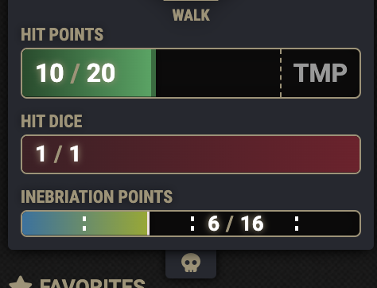
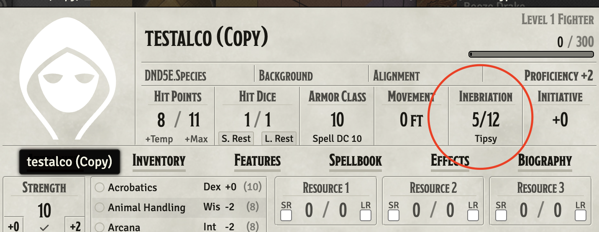
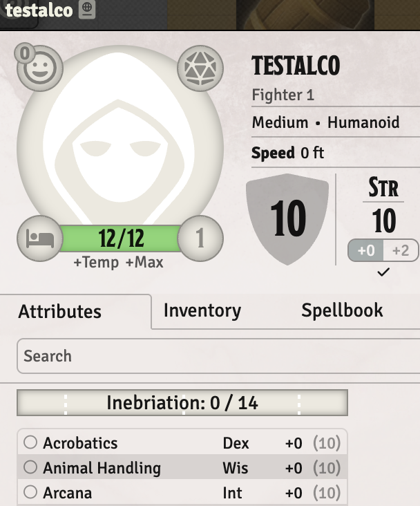
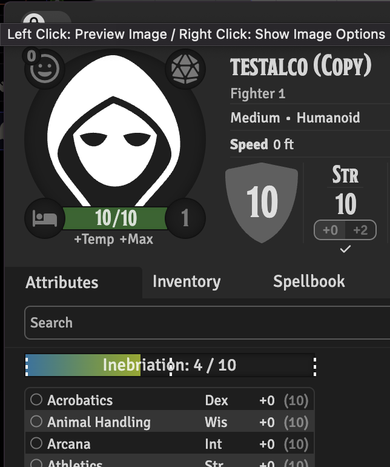
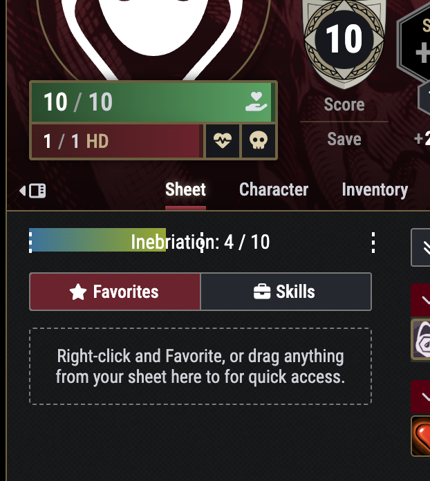
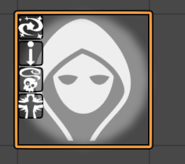
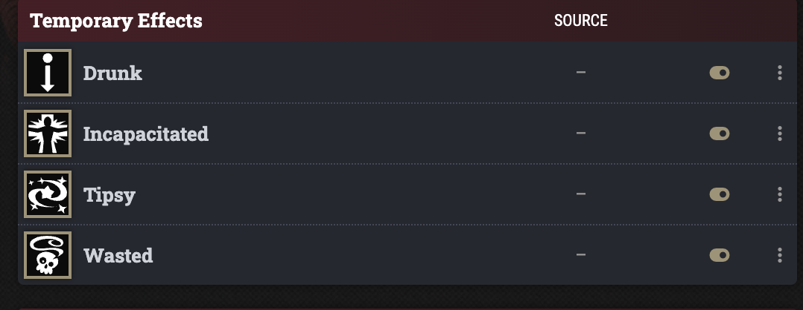
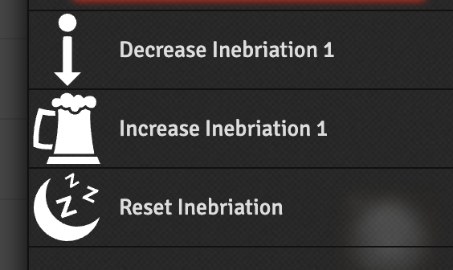
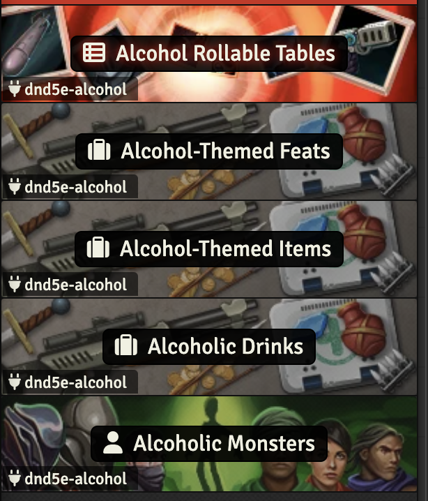

# dnd5e-alcohol

<!--
-->

This is a module for the tabletop roleplaying game Dungeons & Dragons 5th Edition (D&D 5E)for the software FoundryVTT that adds alcohol consumption and its effects to the game. Its main mechanic is an inebriation point system that tracks how drunk a character is, and applies various conditions and effects based on their level of inebriation.

> DISCLAIMER (shortened):
> dnd5e-alcohol is a fantasy roleplaying module for FoundryVTT and does not promote or encourage real-life alcohol consumption. This is purely fictional and should not be interpreted as endorsing drinking, especially underage drinking or alcohol use during pregnancy. I seek no financial gain from this module. Please play and drink responsibly, and remember that real-world alcohol consumption carries risks. (See full disclaimer at bottom of Readme.)

Inspired by this [ruleset by CupidFaust on GMBinder](https://www.gmbinder.com/share/-M0rTarrzYJgR5jiH0j6#:~:text=Once%20your%20Alcohol%20Level%20is%20equal%20to%20one%20half%20of,Wisdom%20checks%20and%20saving%20throws)
Many changes have been made to better fit the base dnd5e system in FoundryVTT.

If you have ideas for enhancements or errors to report, use the "issues" on this repo.

> When the module is updated, items you have already imported from the compendiums will remain unchanged. Unless you import them from the compendiums again.

## Inebriation "points"
The characters now have a numeric flag of how many "inebriation points" they have. Consuming alcohol will prompt for a Save, if the save is failed, the potency and properties from the drink can be manually applied to the character from the chatcard.

### Inebriation meter in character sheet
 \
There is a bar / meter in the character sheet that shows the current inebriation points.

#### Supported sheets:
- Legacy 5e
- Default 5e (first introduced in v11 of Foundry?)
- Tidy5e classic (foundry v12)
- Tidy5e classic (foundry v13)
- Tidy5e "quadrone" (foundry v13)

 \
 \
 \
 \

### Thresholds for new conditions
 \
When the inebriation points reach certain thresholds (decided by your constitution score), you will get increasing worse alcohol-induced conditions. Tipsy > Drunk > Wasted (+Poisoned) > Incapacitated.

#### Tipsy
- +2 to persuasion
- -2 to insight
- -2 to wisdom saves

### Drunk
- -2 to all attacks
- -2 to int and wisdom checks and saves

### Wasted
- Poisoned condition
- May vomit uncontrollably
- May fail regaining hp, hit dice and spell slots on first long rest

## 3 Macros for the DM
 \
By selecting tokens, the GM can manipulate the inebriation points with these 3 macros.

## Rest
Taking a short rest will reduce the inebriation points on a character by 1.
Taking a long rest will reduce inebriation to 0, but going to bed with the Wasted condition might ruin your sleep, and hinder you from regaining spell slots, hp and hit dice (constitution save).

# Compendiums
 \

## Alcoholic Drinks

The drinks have an active effect they apply, this is replaced with potentially added inebriation points and other properties if the character fails a save. This means you can add new items that add inebriation points and the properties available in the module by following the naming convention on the ActiveEffect: "Alcohol - Potency 1 - Dangerous - Disarming" for example. Swap the number for the potency of the drink, and add as many of the properties as you want seperated by dashes.

#### Dangerous
Upgrade unarmed strikes to 1d4.

#### Disarming
-5 to perception checks

#### Infatuating
-2 to charisma and wisdom saves

#### Racial
Can choose to fail if matching race / species, and gain 1 less potency from drink.

#### Sobering
Subtracts inebriation points, instead of adding them.

#### Wild Magic
Rolls on a Wild Magic table, with effects on the drinker.

## Alcoholic Monsters

### Booze Drake
- Has a breath weapon that can add inebriation points to characters.

### Rum Gremlin
- Drunk characters might be frightened by the sight of a Rum Gremlin.

### Swarm of Rum Gremlins
- Drunk characters might be frightened by the sight of the Swarm of Rum Gremlins.
- The swarm might make characters in their space affected by a drink
- Their Tequila spitup can add inebriation points to characters.

### Keg Golem
- Can use an action to "open tap" and make a slippery trail, that characters might slip on if they cross it.

## Alcohol-Themed Items
- Barroom Knucks: Improves unarmed strikes and improved weapon damage while drunk.
- Drunkard's third leg: Adds extra movement when gaining alcoholic conditions.
- Head Cleaner: 10 sobering points in one bottle.

## Alcohol-Themed Feats
- Deep Gut
- Liquid Courage
- Liquid Talent
- Temperance of Mind

# Full Disclaimer

## Fantasy Content Only
This module, dnd5e-alcohol, is designed exclusively for use within the fantasy roleplaying game Dungeons & Dragons 5th Edition (D&D 5E) and FoundryVTT. It is purely fictional and does not promote, endorse, or encourage real-life alcohol consumption. Any depictions of alcohol use are intended as elements of storytelling and roleplay within a fantasy setting.

## No Encouragement of Real-Life Drinking
The content of this module should not be interpreted as advocating or normalizing alcohol consumption, particularly in real life. Alcohol consumption carries real-world risks, including health concerns, legal restrictions, and social consequences.

## Underage Drinking
If you are under the legal drinking age in your country or region, do not use this module as a justification for engaging in alcohol consumption. Underage drinking is illegal and can have serious consequences for health and well-being.

## Pregnancy and Alcohol Consumption
Drinking alcohol during pregnancy can cause serious health risks, including fetal alcohol spectrum disorders (FASD). The in-game mechanics in this module do not reflect or encourage real-world consumption during pregnancy.

## No Financial Gain
This module is a free, fan-made project and is not affiliated with, endorsed by, or sponsored by Wizards of the Coast, FoundryVTT, or any alcohol-related entity. No financial gain is sought from its development, distribution, or use.

## Use Responsibly
Players and Game Masters (GMs) are responsible for ensuring that their use of this module aligns with their own ethical and legal responsibilities. If you or someone you know is struggling with alcohol-related issues, please seek appropriate professional help.

By using this module, you acknowledge that it is purely a tool for roleplaying in a fantasy environment and does not promote or condone real-life alcohol consumption.